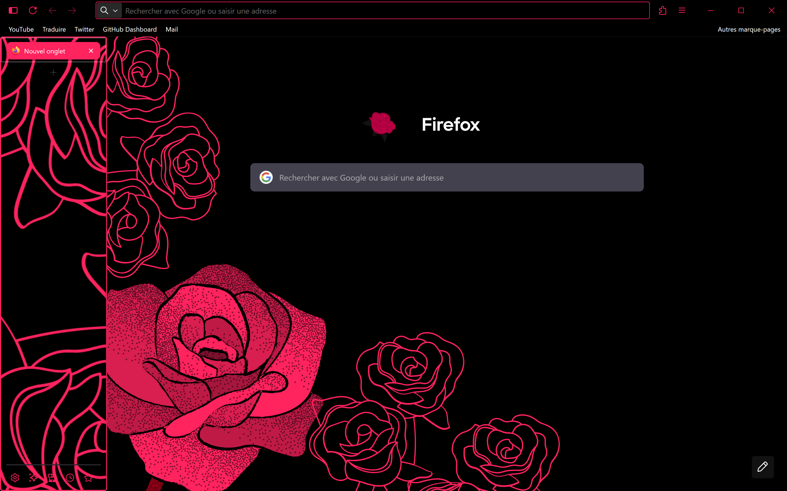

# StyleMyFox
<div align=center>
  
  
  
</div>

Style your Firefox with simple CSS configurations and easy to custom!

## How to install 
1. Download the files
3. Go to `about:profiles`
2. Find your profile    ( *This is the profile in use and it cannot be deleted.* )
3. Open the profile's root directory
5. Move the `chrome` files there
6. Restart Firefox

> [!NOTE]
> This CSS doesn't change the color scheme of your firefox, so it may look different on your platform.


> [!IMPORTANT]
> Please set the following settings to `true` in your `about:config` tab if you want this css to work properly:
> 
> `toolkit.legacyUserProfileCustomizations.stylesheets`
> 
> `svg.context-properties.content.enabled`
> 
> `layout.css.has-selector.enabled`

For futher informations about what is userChrome.css and how to remove it check [this link](https://support.mozilla.org/en-US/kb/contributors-guide-firefox-advanced-customization).

## How to Modify 
Every parameters to modify the configuration is on the `config.css` file.
> [!NOTE]
> Every parameters is explain on the file here's an extract to better comprehend : 

```css
  /* ===== Sidebar border (set style to 'none' to disable) ===== */
  --sidebar-border-style: solid;          /* solid | dashed | dotted | none */
  --sidebar-border-width: 2px;            /* 0px to hide */
  --sidebar-border-color: #FF235E;        /* use 'transparent' to hide */
  --sidebar-border-radius: 5px;
```
## Example
Here is my configuration :

You can have it in the `Configurations` file. His name is `FlowerPower`.
> [!NOTE]
> You can contribute to this project by adding your configuration. See `CONTRIBUTING.md`.
## Specifications 

This repository have been made with some features and elements from [this repository](https://github.com/Bali10050/FirefoxCSS/tree/alt).

You can remove them if you want :
   - Newtab new look          → line 3  to 8   `userChrome.css`
   - Animation bookmark icons → line 10 to 13  `userChrome.css`

## About 

Certain parameters are not complete so bugs can occurs. Also the project will evolve in the future to provide more correction and feature. So if you don't want to miss those new things and support me at the same time, you can leave a ⭐ to this repository!
