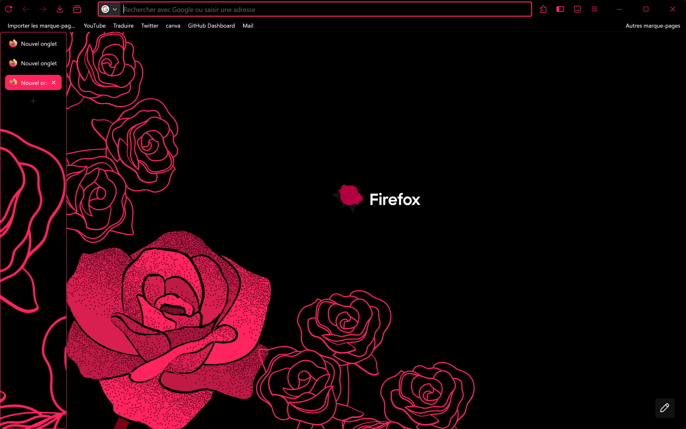

# StyleMyFox


<div align=center>
  
  
  
  <p></p>
  <p>Style your Firefox with simple and easy to custom CSS configurations!</p>
</div>


> [!IMPORTANT]
> StyleMyFox is a form of "DLC" of the add-on [Firefox Color](https://addons.mozilla.org/fr/firefox/addon/firefox-color/).
> This repository help to configure things that Firefox Color doesn't configure such as a linear gradient for the Side bar.
> Also it add some CSS "hacks" that you can activate/deactivate. So consider checking on the add-on for primer configuration.

## How to install 
1. Download the files
3. Go to `about:profiles`
2. Find your profile    ( *This is the profile in use and it cannot be deleted.* )
3. Open the profile's root directory
5. Move the `chrome` files there
6. Restart Firefox

> [!NOTE]
> This CSS doesn't change the color scheme of your firefox, so it may look different on your platform.


> [!IMPORTANT]
> Please set the following settings to `true` in your `about:config` tab if you want this css to work properly:
> 
> `toolkit.legacyUserProfileCustomizations.stylesheets`
> 
> `svg.context-properties.content.enabled`
> 
> `layout.css.has-selector.enabled`

For futher informations about what is userChrome.css and how to remove it check [this link](https://support.mozilla.org/en-US/kb/contributors-guide-firefox-advanced-customization).

## How to Modify 
Every parameters to modify the configuration is on the `config.css` file.
> [!NOTE]
> All parameter names are simple and the possible values ​​are written alongside in the file, here is an extract for better understanding:
```css
  /* ===== Sidebar background ===== */
  --sidebar-bg-color: transparent;        /* transparent to use Firefox default */
  --sidebar-gradient: none;               /* linear-gradient([0-360]deg,#[color_to],#[color]) or 'none' */
  --sidebar-bg-image: none;               /* url("images/Sidebar_background.png") or 'none' (modify Sidebar_background.png with your file in the chrome folder)*/
```
## Example
Here is my configuration :

<div></div>

You can have it in the `Configurations` file. His name is `FlowerPower`.
> [!NOTE]
> You can contribute to this project by adding your configuration. See `CONTRIBUTING.md` [Here](https://github.com/Wanous/StyleMyFox/blob/main/CONTRIBUTING.md).
> 
## Specifications 

StyeMyFox have been made with some features and elements from [this repository](https://github.com/Bali10050/FirefoxCSS/tree/alt).

You can remove them by commentering them in the start of the `config.css` file :

```css
@import url(hacks/Newtab_look.css);          
@import url(hacks/Animated_bookmarks.css);   
```
to 
```css
/*@import url(hacks/Newtab_look.css);*/     
/*@import url(hacks/Animated_bookmarks.css);*/
```
## About 

Certain parameters are not complete so bugs can occurs. Also the project will evolve in the future to provide more correction and feature. So if you don't want to miss those new things and support me at the same time, you can leave a ⭐ to this repository!

Thanks [](https://github.com/Dr-DeathDefying)
 for the idea 🫶 
